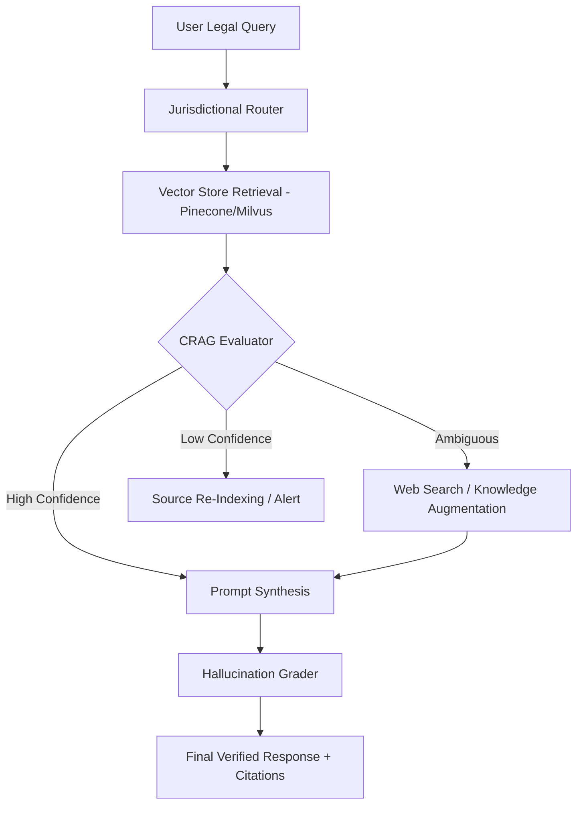

# LexVerify: Corrective RAG (CRAG) for Legal Citation Integrity

**LexVerify** is an advanced Retrieval-Augmented Generation (RAG) framework designed specifically for high-stakes legal environments. Unlike standard RAG pipelines that suffer from "semantic drift" and "legal hallucinations," LexVerify implements a **Corrective Retrieval-Augmented Generation (CRAG)** architecture to evaluate, filter, and verify legal citations before they reach the generation phase.

## ⚖️ The Problem: The "Mata v. Avianca" Risk
In the legal domain, a single hallucinated case citation or an outdated statute can lead to sanctions and loss of reputation. Standard RAG systems often retrieve "semantically similar" but legally irrelevant or overturned documents.

## 🚀 The Solution: Corrective RAG
LexVerify introduces a **Self-Reflective Critic** layer between retrieval and generation. It evaluates the quality of retrieved documents against a "Legal Truth" threshold and triggers corrective actions—such as web-search fallback or knowledge-base refinement—when the retrieved context is insufficient.

### Key MLE Features:
* **Weighted Jurisdictional Retrieval:** Prioritizes statutes and case law based on specific state/federal jurisdictions.
* **Knowledge-State Evaluator:** A fine-tuned "Critic" model (Llama-3-8B-Instruct) that scores retrieved snippets for legal relevance and "Good Law" status.
* **Iterative Refinement Loop:** If retrieval is scored as *Ambiguous* or *Low Quality*, the system triggers a targeted search via Tavily/Serper to find contemporary legal updates.
* **Citation Attribution Masking:** Ensures every sentence in the final output is mapped to a specific, verified URI or document ID.

---

## 🏗️ System Architecture



---

## 🛠️ Tech Stack
* **Orchestration:** LangGraph / LlamaIndex
* **Vector Database:** Pinecone (Serverless) using `text-embedding-3-small`
* **Models:** GPT-4o (Generator), Llama-3-8B (Evaluator/Critic)
* **Evaluation:** RAGAS (Faithfulness & Answer Relevancy)
* **Data:** Sample dataset of FL/CA Personal Injury Statutes and Case Summaries.

---

## 📊 Performance Metrics
LexVerify is benchmarked against standard RAG on the following metrics:
* **Citation Accuracy:** % of generated citations that exist and are relevant to the jurisdiction.
* **Hallucination Rate:** Measured via NLI (Natural Language Inference) against the source documents.
* **Latency vs. Reliability:** Optimization of the CRAG loop to ensure sub-3s response times while maintaining a "Critic" pass.

---

## 🚦 Getting Started

### Prerequisites
* Python 3.10+
* Poetry (Package Management)
* OpenAI & Tavily API Keys

### Installation
```bash
git clone https://github.com/yourusername/LexVerify-CRAG.git
cd LexVerify-CRAG
pip install -r requirements.txt
```

### Run the Evaluation Suite
```bash
python evaluate_legal_benchmarks.py --jurisdiction "Florida"
```

---

## 🔮 Roadmap / Future Work
- [ ] **GraphRAG Integration:** Moving from vector embeddings to a Knowledge Graph to capture "Overturned/Affirmed" relationships between cases.
- [ ] **Distilled Critic Model:** Training a 1B parameter "Legal Critic" to reduce latency in the evaluation loop.
- [ ] **Multi-Step Reasoning:** Supporting complex queries like "Compare Statute of Limitations for medical malpractice across the Tri-State area."
