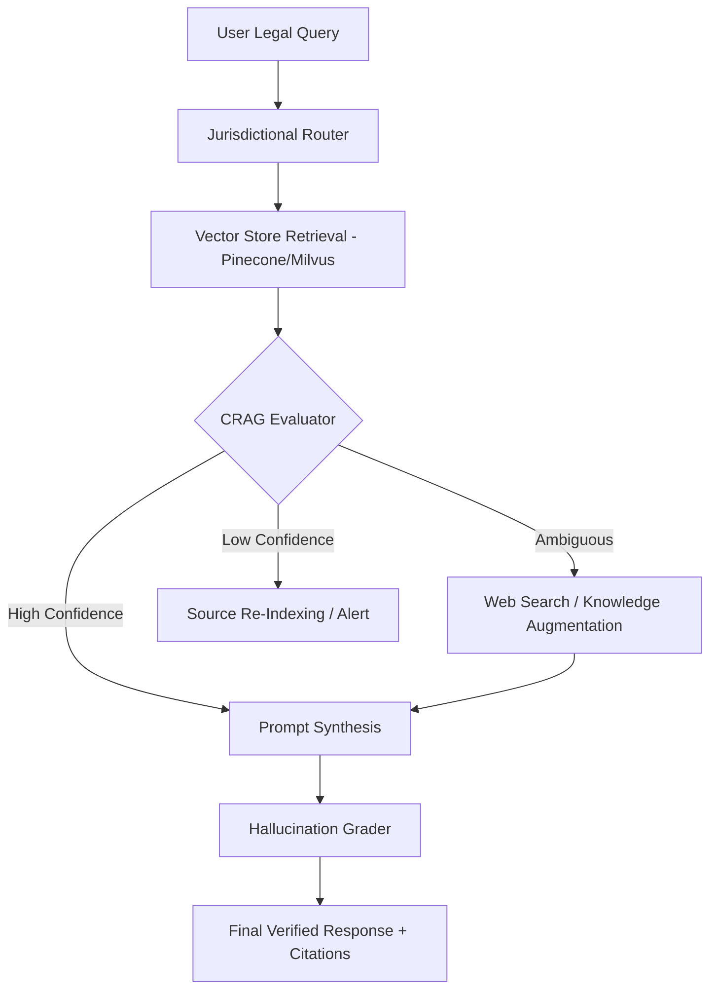

# LexVerify: Corrective RAG (CRAG) for Legal Citation Integrity

**LexVerify** is an advanced Retrieval-Augmented Generation (RAG) framework designed specifically for high-stakes legal environments. Unlike standard RAG pipelines that suffer from "semantic drift" and "legal hallucinations," LexVerify implements a **Corrective Retrieval-Augmented Generation (CRAG)** architecture to evaluate, filter, and verify legal citations before they reach the generation phase.

## ⚖️ The Problem: The "Mata v. Avianca" Risk
In the legal domain, a single hallucinated case citation or an outdated statute can lead to sanctions and loss of reputation. Standard RAG systems often retrieve "semantically similar" but legally irrelevant or overturned documents.

## 🚀 The Solution: Corrective RAG
LexVerify introduces a **Self-Reflective Critic** layer between retrieval and generation. It evaluates the quality of retrieved documents against a "Legal Truth" threshold and triggers corrective actions—such as web-search fallback or knowledge-base refinement—when the retrieved context is insufficient.

### Key MLE Features:
* **Weighted Jurisdictional Retrieval:** Prioritizes statutes and case law based on specific state/federal jurisdictions.
* **Knowledge-State Evaluator:** A fine-tuned "Critic" model (Llama-3-8B-Instruct) that scores retrieved snippets for legal relevance and "Good Law" status.
* **Iterative Refinement Loop:** If retrieval is scored as *Ambiguous* or *Low Quality*, the system triggers a targeted search via Tavily/Serper to find contemporary legal updates.
* **Citation Attribution Masking:** Ensures every sentence in the final output is mapped to a specific, verified URI or document ID.

---

## 🏗️ System Architecture



---
## Repo Structure

```
lexverify-crag/
├── .env.example                # Template for API keys (OpenAI, Tavily, Pinecone)
├── .gitignore
├── README.md                   # The one I wrote for you
├── pyproject.toml              # Or requirements.txt (Poetry/Conda preferred)
│
├── data/                       # DO NOT UPLOAD LARGE DATA TO GIT
│   ├── raw/                    # Raw .pdf or .json legal statutes (sample)
│   ├── processed/              # Cleaned text/chunks for embedding
│   └── gold_standard/          # The "Ground Truth" Q&A pairs for evaluation
│
├── src/                        # Main source code
│   ├── __init__.py
│   ├── config.py               # Hyperparameters (top_k, temperature, thresholds)
│   ├── main.py                 # CLI entry point to run the pipeline
│   │
│   ├── core/                   # The "Brain" of the CRAG architecture
│   │   ├── router.py           # Jurisdictional routing logic
│   │   ├── retriever.py        # Vector DB (Pinecone/Milvus) interface
│   │   ├── evaluator.py        # THE CORE: The "Self-Reflective Critic" logic
│   │   └── generator.py        # Final response synthesis + citation formatting
│   │
│   ├── agents/                 # If using LangGraph/Multi-agent logic
│   │   ├── web_search.py       # Fallback search (Tavily/Serper)
│   │   └── grader.py           # Hallucination/Relevance grading prompts
│   │
│   └── utils/                  # Helper functions
│       ├── legal_cleaning.py   # Regex/parsing for legal citations
│       ├── embeddings.py       # Embedding model wrappers
│       └── logger.py           # Structured logging for debugging
│
├── notebooks/                  # MLE Research Phase
│   ├── 01_eda_legal_docs.ipynb # Initial data exploration
│   └── 02_rag_benchmarking.ipynb # Comparing Baseline RAG vs. LexVerify CRAG
│
├── evals/                      # The "Science" part of MLE
│   ├── run_evals.py            # Script to run RAGAS / DeepEval
│   └── results/                # JSON/CSV outputs of performance metrics
│
├── prompts/                    # Keep prompts separate from code
│   ├── evaluator_v1.yaml
│   ├── generator_v1.yaml
│   └── jurisdictional_rules.json
│
└── tests/                      # Unit tests for core logic
    ├── test_retrieval.py
    └── test_critic_scoring.py
```
---

## 🛠️ Tech Stack
* **Orchestration:** LangGraph / LlamaIndex
* **Vector Database:** Pinecone (Serverless) using `text-embedding-3-small`
* **Models:** GPT-4o (Generator), Llama-3-8B (Evaluator/Critic)
* **Evaluation:** RAGAS (Faithfulness & Answer Relevancy)
* **Data:** Sample dataset of FL/CA Personal Injury Statutes and Case Summaries.

---

## 📊 Performance Metrics
LexVerify is benchmarked against standard RAG on the following metrics:
* **Citation Accuracy:** % of generated citations that exist and are relevant to the jurisdiction.
* **Hallucination Rate:** Measured via NLI (Natural Language Inference) against the source documents.
* **Latency vs. Reliability:** Optimization of the CRAG loop to ensure sub-3s response times while maintaining a "Critic" pass.

---

## 🚦 Getting Started

### Prerequisites
* Python 3.10+
* Poetry (Package Management)
* OpenAI & Tavily API Keys

### Installation
```bash
git clone https://github.com/yourusername/LexVerify-CRAG.git
cd LexVerify-CRAG
pip install -r requirements.txt
```

### Run the Evaluation Suite
```bash
python evaluate_legal_benchmarks.py --jurisdiction "Florida"
```

---

## 🛡️ Production Safety Rails

### Rate Limiting & Token Costs

The CRAG pipeline makes multiple LLM calls per query. Here's how we manage the cloud bill:

| Stage | API | Avg Cost/Query | Rate Limit Strategy |
|-------|-----|:--------------:|---------------------|
| **Route** | OpenAI GPT-4o | ~$0.005 | Cached for repeated queries |
| **Evaluate** | OpenAI GPT-4o | ~$0.02 | **Distilled critic** reduces to $0.00 (local Ollama) |
| **Generate** | OpenAI GPT-4o | ~$0.03 | `max_tokens=2048` cap |
| **Grade** | OpenAI GPT-4o | ~$0.02 | Skippable in low-risk mode |
| **Augment** | Tavily | ~$0.01 | Circuit breaker: max 5 results, 1 call/query |
| **Embed** | OpenAI | ~$0.0001 | 1024-dim (not 3072) to reduce cost |
| **TOTAL** | | **~$0.08** | **~$0.01 with distilled critic** |

### Fallback Circuit Breaker

The web search fallback (`WebSearchAgent`) is guarded:
- **Max 5 results per augmentation** — prevents runaway Tavily costs
- **Domain whitelist** — only searches `law.cornell.edu`, `casetext.com`, `findlaw.com`, `justia.com`, `courtlistener.com`, `scholar.google.com`
- **Graceful degradation** — if Tavily is down or rate-limited, the pipeline generates from available docs with a lower confidence flag

### Pinecone Resilience

The retriever wraps all Pinecone calls in `try/except`. If the vector store is unavailable:
1. Returns empty document list
2. CRAG evaluator triggers `REINDEX`
3. Pipeline falls back to Tavily web search
4. Response clearly indicates web-sourced data

### Cost Optimization Path

```
Production mode:   GPT-4o critic         → ~$0.08/query
Fast mode (--fast): Ollama phi3:mini     → ~$0.03/query (no eval cost)
Batch mode:        Distilled + skip grade → ~$0.01/query
```

---

## 🔮 Roadmap / Future Work
- [x] **GraphRAG Integration:** Knowledge graph (NetworkX) captures "Overturned/Affirmed/Amended" relationships between cases for Good Law verification.
- [x] **Distilled Critic Model:** Ollama-based fast local critic with GPT-4o escalation for ambiguous scores (`--fast` flag).
- [x] **Multi-Step Reasoning:** Cross-jurisdiction comparison via query decomposition, parallel CRAG sub-pipelines, and synthesis (`compare` command).
